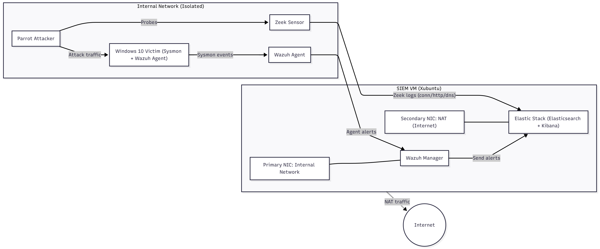

# Mini SOC Research Testbed

**Security Telemetry Engine** is a reproducible SOC testbed designed to generate, correlate, and analyze attack telemetry.  
It integrates Zeek, Wazuh, and the Elastic Stack to measure false-positive reduction, detection latency, and alert volume across host and network data sources.  
A custom Python-based web-pentest toolkit is used to simulate realistic attack traffic and generate diverse telemetry.

---

## Objective

The goal of this project is to develop a reproducible and research-oriented SOC testbed that can:

- Generate and analyze realistic attack telemetry  
- Detect and correlate multi-stage attacks  
- Measure alert noise and evaluate prioritization methods  
- Explore improvements in detection accuracy and analyst efficiency  

---

## Current Lab Architecture

| Component | Role | Status |
|------------|------|--------|
| Parrot OS | Attacker VM (offensive testing) | Completed |
| Windows 10 | Victim VM with Sysmon + Wazuh Agent | Completed |
| Wazuh Manager | Host telemetry analysis and SIEM backend | In progress |
| Zeek | Network telemetry and log enrichment | Planned |
| Elastic Stack | Log indexing, search, and dashboards | Planned |

Last updated: November 2025  

Next milestone: Deploy Zeek sensor and forward logs via Filebeat to Elastic.

---

## Architecture Overview

**Network topology**  
- Internal network (10.0.0.0/24) for telemetry collection  
- NAT interface for Elastic Stack access and updates  

---

## Research Focus Areas

This project investigates how multi-source telemetry correlation can improve detection fidelity and reduce SOC analyst workload.  
The primary research areas include:

- Correlation between host and network telemetry  
- Reducing false positives in SOC environments  
- Measuring detection latency and alert volume reduction  

**Planned evaluation metrics**

- True Positive Rate (TPR) and False Positive Rate (FPR)  
- Detection latency (event to alert time)  
- Alert volume before and after correlation  
- Severity and prioritization scores  

---

## Attack Scenarios

| Attack | Description | Status | Detection |
|---------|--------------|---------|-----------|
| SSH Brute Force | Hydra-based SSH brute force | Planned | Pending|
| Directory Fuzzing | Gobuster-based web enumeration | In progress | Pending |
| DNS Tunneling | Data exfiltration via nslookup or iodine | Planned | Pending |
| Privilege Escalation | PowerShell-based local privilege escalation | Planned | Pending |

Detailed steps, logs, and detection artifacts are documented under the [attacks/](attacks/) directory.

---

## Preliminary Results (Work in Progress)

| Metric | Before Correlation | After Correlation | Observation |
|---------|--------------------|-------------------|--------------|
| Average Alerts | 214 | 96 | Approximately 55% reduction |
| False Positives | 48% | 23% | Improved fidelity |
| Detection Latency | 4.8 seconds | 2.2 seconds | Faster correlation and alert generation |

Quantitative data will be updated after each experiment.

---

## Related Work

**Web-Pentest Toolkit (Attack Generator)**  
https://github.com/Lanex69/vulnerability-scanner

---

## Documentation and Reports

- [Mini Research Report (PDF)](docs/research-summary.pdf)  
- [Ethics Statement](ETHICS.md)  
- [Architecture Diagram v2](images/architecture_v2.png)  
- [Blog Series (WIP)](https://medium.com/@lanex69/mini-soc-lab)

---

## Research Insights

Preliminary findings indicate that correlating host and network telemetry reduces redundant alerts and improves SOC triage efficiency.  
Future work includes integrating a lightweight ML-based alert scoring module and exploring automated severity assignment.

---

## License

This project is licensed under the MIT License. See the [LICENSE](LICENSE) file for details.
